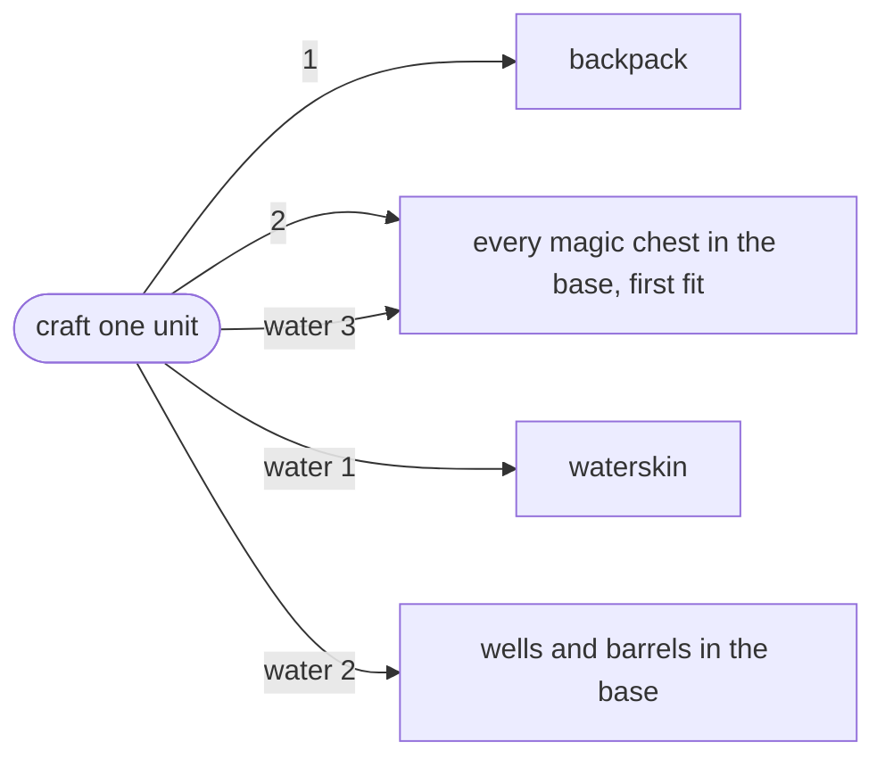
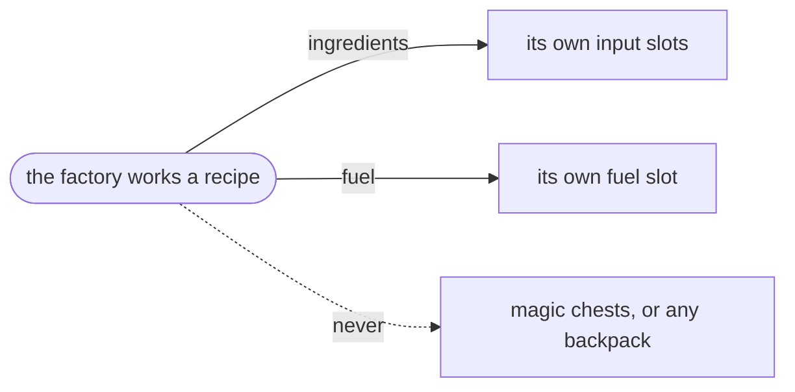
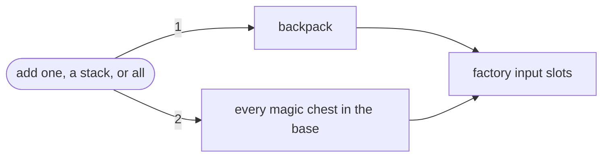
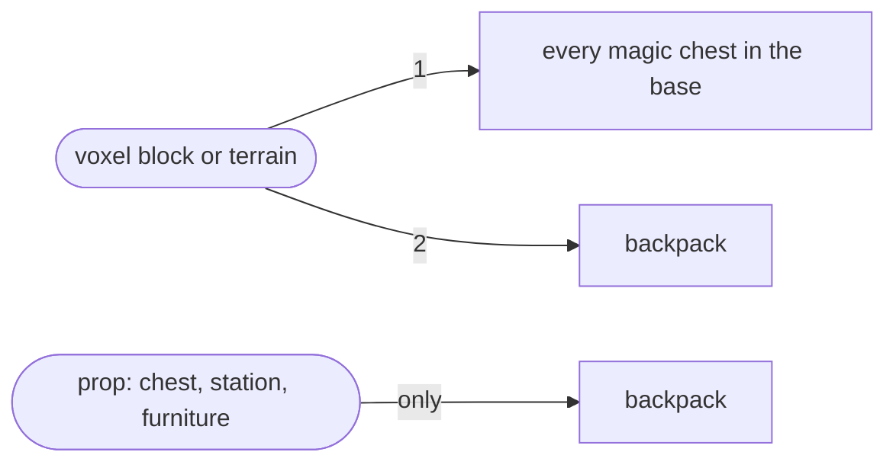
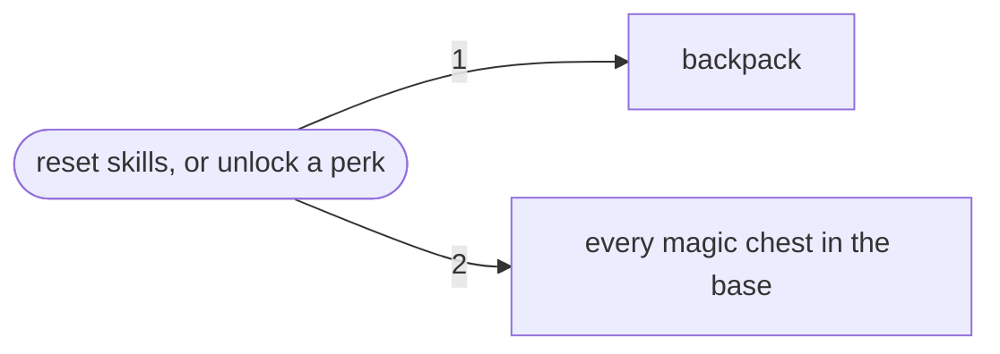
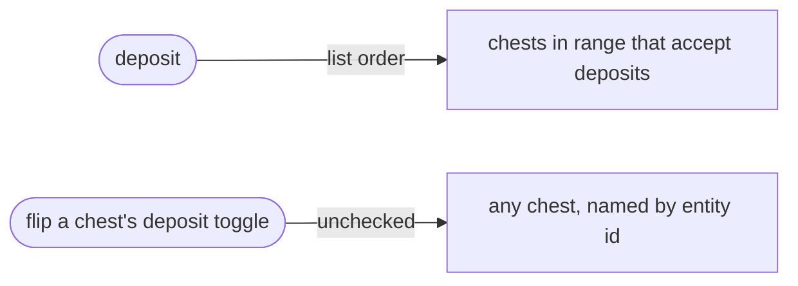
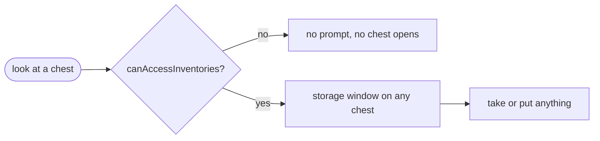

# Draw and deposit paths

How Enshrouded itself moves items into and out of containers, as a player meets
it. Everything below is the game's own behavior, with no mod loaded.

Every section is one path. Inside it, the game's behavior sits under a `Vanilla`
heading. The mod's behavior on that same path joins it under a second heading in
the same section once the mod lands, so a reader holds both models for one path
at once.

Every diagram reads left to right, and the number on an edge is the order the
game takes that source in.

## What every path shares

A base is a Flame Altar's build zone, the box the altar draws around itself, and
the zone grows as the altar does. Altar zones that overlap merge into a single
base, so several altars can feed the same pool. No path draws a radius around a
chest. A chest supplies a station anywhere in the same base, however far apart
the two stand. A chest outside every altar zone supplies nothing at all.

The game picks the base from the acting player's position on every path but the
Quick Stack Station, which picks it from the station's position. A player
standing outside every altar zone reaches no chest and works from the backpack
alone.

Only a magic chest supplies a draw. An ordinary chest of the same tier holds the
same items and feeds nothing, so its only path is a player moving items by hand.
Fruit and nut plants a player planted supply a draw the way a magic chest does.

Vanilla knows nothing about who owns a chest. Any player the server lets into
inventories opens any chest in reach. Any player flips any chest's deposit
toggle. The handler that moves an item between a chest and a backpack checks
neither permission nor range.

The crafting screen adds the backpack to every magic chest of the base and shows
the sum. A recipe reads as craftable whenever the base holds its materials.

## Workshop crafting

A player picks a recipe at a station and crafts it.

### Vanilla

The station is a workbench, an NPC workshop, the Flame Altar, a cooking station,
a shroud gem forge or a factory. Hand crafting from the backpack menu runs this
same path, with the player standing in for the station. Every NPC crafter counts
as a station, as does every townsfolk trader, and no player places any of them.

Crafting spends the backpack first. For each ingredient in turn the game empties
what the backpack holds. It then walks the magic chests of the base and takes
from the first chest that carries the rest. Every unit of a stacked craft runs
that walk on its own.

A recipe that asks for water takes it from the waterskin first. Then it takes
from the wells and water barrels of the base. The magic chests come last.

## A factory's own craft

A factory works through the recipe a player queued in it.

### Vanilla

A factory spends its own input slots and its own fuel slot. It reaches no chest
and no backpack, and it pulls nothing while it runs. A kiln burns what a player
put in it and nothing else.

## The factory's magic chest tab

A player opens a factory and presses add one, a stack, or all.

### Vanilla

The pull empties the pressing player's backpack first, then walks the magic
chests of the base. What it gathers lands in the factory's input slots. The tab
is a button a player presses, so a factory that nobody touches fills from
nowhere.

## The build hammer

A player places a voxel block, shapes terrain, or places a prop.

### Vanilla

Voxel blocks and terrain take from the magic chests of the base first and from
the backpack last. That order is the reverse of crafting. A prop, which is a
chest, a station or a piece of furniture, comes out of the backpack alone. No
station takes part in either. Dismantling and undoing refund into the backpack,
and repairing spends no material.

## The skill reset and perk unlock costs

A player resets their skills, or unlocks a perk on a piece of gear.

### Vanilla

Both costs come out of the backpack first and then out of the magic chests of
the base. No station stands anywhere on either path, so the base is whichever
one the player is standing in.

## The Quick Stack Station

A player deposits their stackables at a Quick Stack Station. Separately, a
player flips the deposit toggle on a chest.

### Vanilla

The station works from the base it stands in rather than the depositor's. It
keeps the magic chests that accept an area deposit, whose toggle is on, and that
stand inside its own range. Each kept chest in turn receives what it already
stocks from the depositor's backpack. A planted fruit or nut plant never accepts
a deposit.

The toggle sets the flag on whatever chest the client names. The server asks
nothing about the sender: not who owns the chest, not what group they are in,
not how far away they stand. So any player turns any chest's deposit on or off.

## Opening a chest by hand

A player looks at a chest and opens it.

### Vanilla

Every chest, ordinary and magic, sits behind the `canAccessInventories`
permission on the player's user group in `enshrouded_server.json`. A player
without it gets no prompt, opens no chest, and crafts from the backpack alone. A
player with it opens every chest on the server.

Moving an item between the open chest and the backpack checks nothing further.
The server checks distance only when a player gifts an item to another player.
The open window is the only gate a stock client meets.

